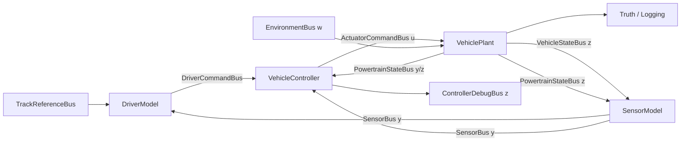

# FSAE 整车仿真平台架构

> 状态：UnifiedControl 扩展版
> 更新日期：2026-08-02
> MATLAB / Simulink：R2026a
> 上位计划：[FSAE 整车仿真模型开发蓝图](../ROADMAP.md)

## 1. 架构目标

本架构覆盖时域闭环整车仿真和准稳态 GGV/圈速两条链。ProjectFoundation 的目标不是实现车辆物理，而是建立可编译、可运行、接口稳定的工程骨架，使后续组件可以并行开发和独立测试。

设计目标：

- Plant、控制器、驾驶员、传感器和场景边界清晰；
- 共享参数只维护一份并可追踪来源；
- 7DOF 与 10DOF 使用相同顶层接口；
- 轮胎、驾驶员和反馈源支持 Variant；
- 控制器不依赖车辆真值；
- 每个 Model Reference 可独立编译、测试和替换；
- 后续可迁移到固定步长、SIL、PIL 和 HIL。

## 2. ProjectFoundation 范围与非目标

### 2.1 ProjectFoundation 交付

- MATLAB Project 和可解析的项目路径；
- `VehicleData.sldd` Data Dictionary；
- 基础参数、Bus 和默认 Bus 结构；
- `FSAE_ClosedLoop.slx` 顶层骨架；
- `DriverModel.slx`、`VehicleController.slx`、`VehiclePlant.slx`、`SensorModel.slx` 占位引用模型；
- 初始化脚本、结构检查和冒烟测试；
- 坐标系、接口、参数来源和待确认问题文档。

### 2.2 ProjectFoundation 不实现

- 7DOF 或 10DOF 动力学；
- Magic Formula、TTC Map 或轮胎拟合；
- 路径跟踪、TV、TC、再生分配或状态估计算法；
- 电机、电池和气动真实动态；
- 未确认车辆参数的“真实值”。

## 3. 时域闭环架构



### 3.1 信号分类

| 类别 | 含义 | 主要实例 |
|---|---|---|
| `u` | 控制器发给 Plant 的命令 | `ActuatorCommandBus` |
| `w` | 外部扰动和环境 | `EnvironmentBus` |
| `y` | 控制器可用测量 | `SensorBus`、受限的 `PowertrainStateBus` |
| `z` | 仅调试/验证真值 | `VehicleStateBus`、轮胎力、真实轮荷、内部约束 |

最终控制器不得读取 `VehicleStateBus` 中的真值字段。ProjectFoundation 顶层也保持 SensorModel 边界，避免后续重接线。

## 4. 模型层级

```text
models/top/FSAE_ClosedLoop.slx
├── TrackReferenceSource       # ProjectFoundation：默认 Bus 常量；后续：Scenario/Track
├── EnvironmentSource          # ProjectFoundation：默认 Bus 常量
├── DriverModel                → models/driver/DriverModel.slx
├── VehicleController          → models/controller/VehicleController.slx
├── VehiclePlant               → models/plant/VehiclePlant.slx
├── SensorModel                → models/components/SensorModel.slx
├── VehicleState               # 顶层真值输出/日志
└── ControllerDebug            # 顶层控制调试输出/日志
```

ProjectFoundation 的四个引用模型只包含最终端口、输入终止块和类型正确的默认 Bus 输出。占位输出不得被解释为物理结果。

## 5. 组件目录

| 组件 | 类型 | 输入 | 输出 | ProjectFoundation 行为 | 后续实现 |
|---|---|---|---|---|---|
| `DriverModel` | Model Reference | `TrackReferenceBus`, `SensorBus` | `DriverCommandBus` | 默认零指令 | OpenLoop / PathTracking / Replay Variant |
| `VehicleController` | Model Reference | `DriverCommandBus`, `SensorBus`, `PowertrainStateBus` | `ActuatorCommandBus`, `ControllerDebugBus` | 禁用且零转矩 | TV、TC、再生、能量管理统一控制 |
| `VehiclePlant` | Model Reference | `ActuatorCommandBus`, `EnvironmentBus` | `VehicleStateBus`, `PowertrainStateBus` | 零状态占位 | 7DOF / 10DOF Variant |
| `SensorModel` | Model Reference | `VehicleStateBus`, `PowertrainStateBus` | `SensorBus` | 零测量占位 | TruthFeedback / SensorEstimatorFeedback Variant |

## 6. Plant 分解

`VehiclePlant.slx` 已实现 OpenLoopPlant 组件集成；TireModel 将原 `TireSimple` 引用替换为统一的 `TireModel`：

```text
VehiclePlant.slx
├── ActuatorDynamics
│   ├── MotorInverterModel
│   ├── GearboxModel
│   ├── BrakeModel
│   └── BatteryPowerLimiter
├── VehicleDynamics Variant
│   ├── Vehicle7DOF
│   └── Vehicle10DOF
├── TireModel Variant
│   ├── TireSimple
│   ├── TireMF62
│   └── TireTTCMap
├── LoadTransferModel
├── AeroModel
└── TruthOutputAssembly
```

轮胎—车辆和电机—逆变器属于紧耦合边界，接口冻结后仍需由同一工作包或明确同步点协调。

Vehicle10DOF 采用隔离集成文件 `VehiclePlant10DOF.slx` 和 `FSAE_Vehicle10DOF_ClosedLoop.slx`，
尚未把生产 `VehiclePlant.slx` 改成运行时 Variant。Vehicle10DOF Plant 中
`Vehicle10DOF` 的动态轮荷直接驱动轮胎；旧 `LoadTransferModel` 只保留为
诊断对比，其输出全部终止。这样可以在实车校准关闭前继续保留 TorqueVectoring/7DOF 基线。

TireModel 的 `TireModel` 是启动时 Variant Subsystem，使用 `TireSelection.ModelMode` 选择：

- `0`：`TireSimple`，保留 OpenLoopPlant 解析回归基线；
- `1`：`TireMF62`，默认整车模式，使用 43075 横向/外倾拟合和 43100 R20 纵向代理；
- `2`：`TireTTCMap`，43075 纯横向/外倾参考真值，输入越界先裁剪再做 8 邻点反距离插值。

高保真参数与数值运行数组均存放于 `VehicleData.sldd`。两个高保真模型使用代码生成兼容的 MATLAB Function 实现，可穿过 `VehiclePlant` 的 Model Reference 边界。

## 7. 控制器分解

```text
VehicleController.slx
├── ModeManager
├── ReferenceGenerator
├── YawController
├── TractionControl
├── RegenBrakeControl
├── EnergyManagement
├── TorqueAllocator
├── OutputLimiting
└── DebugAssembly
```

控制器必须明确：

- 每个积分器的初值、复位和防积分饱和；
- 每个执行器输出的限幅和速率限制；
- 模式切换的无扰切换策略；
- 多速率边界和 Rate Transition；
- 反馈极性和横摆力矩符号；
- 所有除法、查表和低速运算的保护。

UnifiedControl 采用隔离集成文件 `UnifiedControlVehicleController.slx` 和
`FSAE_UnifiedControl_ClosedLoop.slx`，并由 `UnifiedControlPathTrackingDriver.slx` 注入四个场景功能
开关。`TorqueAllocator.slx` 在单次投影计算中同时处理电机、轮胎估算、TC、
转矩变化率与驱动功率约束，再由执行器混合层分配再生和剩余摩擦制动；它不会让
TV、TC、再生和能量管理依次覆盖彼此输出。Stateflow 仅持有前一拍电机转矩和
TC 滞环状态，估算、投影和混合函数保持独立可测。

## 8. Variant 策略

| Variant | 选项 | 当前默认 |
|---|---|---|
| `VehiclePlantVariant` | `Vehicle7DOF`, `Vehicle10DOF` | 7DOF 生产基线；10DOF 当前通过隔离 Vehicle10DOF Plant 选择 |
| `TireModelVariant` | `TireSimple`, `TireMF62`, `TireTTCMap` | `TireMF62` |
| `DriverVariant` | `DriverOpenLoop`, `DriverPathTracking`, `DriverReplay` | 路径跟踪；UnifiedControl 使用隔离的 `UnifiedControlPathTrackingDriver` |
| `FeedbackVariant` | `TruthFeedback`, `SensorEstimatorFeedback` | 当前闭环使用传感器边界内的 truth-feedback 基线 |

Variant 控制变量存放于 `VehicleData.sldd`，不得散落在 Base Workspace。

## 9. 数据与参数架构

```text
data/VehicleData.sldd
├── Vehicle.*
├── Tire.*
├── Aero.*
├── Powertrain.*
├── Battery.*
├── Brake.*
├── Control.*
├── Simulation.*
├── Variant.*
├── TorqueVectoringControlDesign / UnifiedControlDesign
├── <Bus Objects>
└── Default<BusName> structures
```

- 所有共享模型通过文件名 `VehicleData.sldd` 关联；
- `data` 目录必须加入 Project Path；
- 每个引用模型目录必须单独加入 Project Path；
- 参数值、单位、来源和可信度记录在 [`data/ParameterSources.md`](../data/ParameterSources.md)；
- ProjectFoundation 未知参数使用 `NaN` 或明确安全占位值，并设置 `IsPlaceholder = true`。

## 10. 速率与求解器

ProjectFoundation 只冻结开发期调度合同，最终部署周期待 VCU 与 CAN 方案确认。

| 组件 | ProjectFoundation/开发期速率 | 类型 | 状态 |
|---|---:|---|---|
| Plant 动力学 | `0` | 连续 | 后续由最快物理动态调整 |
| 电机接口 | `0.001 s` | 离散占位 | 暂定 |
| Sensor / Estimator | `0.005 s` | 离散占位 | 暂定 |
| Vehicle Controller | `0.005 s` | 离散占位 | 暂定 |
| Driver / Path Tracking | `0.010 s` | 离散占位 | 暂定 |
| Energy Management | `0.050 s` | 离散占位 | 暂定 |

ProjectFoundation 顶层使用变步长连续求解器，以便后续排查物理模型；占位模型使用继承采样时间和常量输出。进入部署阶段前必须转换为明确的固定步长多速率配置。

## 11. 数值与耦合风险

| 风险 | 架构措施 |
|---|---|
| 低速滑移率奇异 | 集中正则化参数和单元测试 |
| 轮胎—轮荷代数环 | 明确迭代/延迟策略，不用 Memory 随意断环 |
| 电池总功率—四轮转矩耦合 | 统一控制分配，不依次覆盖输出 |
| Bus 修改波及引用模型 | ProjectFoundation 冻结后执行影响分析和全量更新图 |
| 真值泄漏到控制器 | 通过 SensorModel 边界隔离 |
| 多速率数据不一致 | 显式 Rate Transition 和时序测试 |
| 未知参数伪精确 | 占位标志、来源表和敏感性扫描 |

## 12. Project 路径

以下目录含可解析模型或数据，必须分别加入 Project Path：

```text
data
models/top
models/plant
models/controller
models/driver
models/components
models/libraries
scripts/initialization
scripts/tire
scripts/simulation
scripts/reporting
tests/smoke
tests/tire
tests/path_tracking
tests/quasi_static
tests/torque_vectoring
tests/vehicle_10dof
tests/unified_control
```

缓存和代码生成输出统一放到绝对路径 `<ProjectRoot>/cache`，依赖缓存使用 `<ProjectRoot>/cache/dep_cache.graphml`。

## 13. ProjectFoundation 集成门禁

- [x] 项目可通过 `openProject` 打开；
- [x] 所有需要的子目录已加入 Project Path；
- [x] `VehicleData.sldd` 可打开且所有 Bus 可解析；
- [x] 四个引用模型可独立更新图；
- [x] 顶层模型可更新图并运行 OpenLoopPlant 后的 ProjectFoundation 非回归仿真；
- [x] 无断线或未连接端口错误；
- [x] 控制器只接收 Sensor/Powertrain 测量，不接收 Vehicle truth；
- [x] 默认输出和合成测试结果均明确标记，不用于性能结论；
- [x] Project health checks 和依赖更新完成（12/12）。
