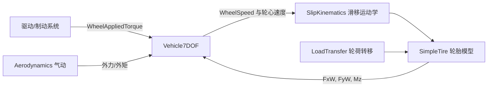

# VehicleDynamicsCore 七自由度车辆动力学核心

> 状态：完成
> 更新日期：2026-07-24
> 模型：`models/plant/Vehicle7DOF.slx`
> 四轮顺序：`[FL, FR, RL, RR]`

## 1. 模型边界

VehicleDynamicsCore 只实现平面车辆刚体、四轮转动和坐标变换，不计算轮胎力、轮荷、驱动系统转矩或空气动力。上述模块后续通过当前物理端口接入。

七个动力学自由度为：

1. 车身纵向速度 `Ux`；
2. 车身横向速度 `Uy`；
3. 横摆角速度 `YawRate`；
4. 四个车轮角速度 `WheelSpeed[4]`。

`X`、`Y`、`Psi` 是用于轨迹输出的运动学积分状态，不计入七个动力学自由度。

## 2. 输入

| 端口 | 维度 | 单位 | 坐标系/正方向 | 后续来源 |
|---|---:|---|---|---|
| `TireForceXWheel` | 4x1 | N | 各轮轮胎坐标系，向轮前方为正 | 轮胎模型 |
| `TireForceYWheel` | 4x1 | N | 各轮轮胎坐标系，向轮左侧为正 | 轮胎模型 |
| `TireAligningMoment` | 4x1 | N·m | 绕 `+z` 为正 | 轮胎模型 |
| `WheelSteerAngle` | 4x1 | rad | 从车身 `+x` 向 `+y` 转为正 | 转向运动学 |
| `WheelAppliedTorque` | 4x1 | N·m | 驱动车轮正转为正；制动为负 | 驱动/制动系统 |
| `ExternalForceXBody` | 1 | N | 车身 `+x` 为正 | 气动、坡度等 |
| `ExternalForceYBody` | 1 | N | 车身 `+y` 为正 | 气动、侧风等 |
| `ExternalYawMoment` | 1 | N·m | 绕 `+z` 为正 | 气动或外部扰动 |

`WheelAppliedTorque` 是已经汇总的轮端施加转矩；轮胎纵向力产生的反作用转矩由模型内部扣除，不能在上游重复扣除。

## 3. 输出

| 输出 | 维度 | 单位 | 说明 |
|---|---:|---|---|
| `X`, `Y` | 各1 | m | 全局位置 |
| `Psi` | 1 | rad | 全局航向角 |
| `Ux`, `Uy` | 各1 | m/s | 质心处车身坐标速度 |
| `YawRate` | 1 | rad/s | 横摆角速度 |
| `UxDot`, `UyDot` | 各1 | m/s² | 车身速度状态导数 |
| `Ax`, `Ay` | 各1 | m/s² | 合外力除以质量，供 IMU/轮荷模块使用 |
| `YawAcceleration` | 1 | rad/s² | 横摆角加速度 |
| `WheelSpeed` | 4x1 | rad/s | 四轮角速度 |
| `WheelVelocityXWheel` | 4x1 | m/s | 各轮心在轮胎坐标系的纵向速度 |
| `WheelVelocityYWheel` | 4x1 | m/s | 各轮心在轮胎坐标系的横向速度 |

为避免这些诊断边界在 `VehiclePlant` 闭环耦合中形成直接馈通代数环，`UxDot`、`UyDot`、`Ax`、`Ay`、`YawAcceleration`、`WheelVelocityXWheel` 和 `WheelVelocityYWheel` 的根级输出使用 Memory 隔离。内部积分和状态方程仍使用当前步计算值；上述边界诊断量相对内部值延迟一个求解器主步。

## 4. 核心方程

每个车轮的轮胎力先由轮胎坐标系旋转到车身坐标系：

```text
FxB_i = FxW_i cos(delta_i) - FyW_i sin(delta_i)
FyB_i = FxW_i sin(delta_i) + FyW_i cos(delta_i)
```

令车轮相对质心位置为 `(x_i, y_i)`，则：

```text
Fx = sum(FxB_i) + ExternalForceXBody
Fy = sum(FyB_i) + ExternalForceYBody
Mz = sum(x_i FyB_i - y_i FxB_i + MzTire_i) + ExternalYawMoment

UxDot   = Fx / m   + YawRate * Uy
UyDot   = Fy / m   - YawRate * Ux
YawRateDot = Mz / Izz

WheelSpeedDot_i = (WheelAppliedTorque_i - Re * FxW_i) / Iw
```

全局运动学为：

```text
XDot   = Ux cos(Psi) - Uy sin(Psi)
YDot   = Ux sin(Psi) + Uy cos(Psi)
PsiDot = YawRate
```

轮心速度首先在车身坐标系计算，再旋转到各轮坐标系：

```text
VxB_i = Ux - YawRate * y_i
VyB_i = Uy + YawRate * x_i
VxW_i =  cos(delta_i) VxB_i + sin(delta_i) VyB_i
VyW_i = -sin(delta_i) VxB_i + cos(delta_i) VyB_i
```

## 5. 参数与初始状态

模型直接使用 `VehicleData.sldd` 中的 `Vehicle`、`Tire` 和 `Vehicle7DOFInitialState`：

- `Vehicle.Mass.Value`、`Vehicle.InertiaYaw.Value`；
- `Vehicle.Wheelbase.Value`、`Vehicle.CGToFrontAxle.Value`；
- `Vehicle.TrackFront.Value`、`Vehicle.TrackRear.Value`；
- `Tire.EffectiveRadius.Value`、`Tire.WheelInertia.Value`；
- `Vehicle7DOFInitialState` 的十个积分初值。

实际车辆参数仍为 `NaN` 占位，只有验证脚本通过 `Simulink.SimulationInput` 临时覆盖为合成参数。合成值不写入生产字典。

轮胎力坐标变换由独立组件 `models/components/ForceCoordinateTransform.slx` 实现，并由 `Vehicle7DOF` 以 Model Reference 方式复用。

## 6. 模块扩展关系



## 7. 验收场景

- 静止零输入保持平衡；
- 无外力的匀速直线运动保持速度且位置解析积分正确；
- 四轮等纵向力产生 `sum(Fx)/m`，匹配轮端反作用转矩时轮速不变；
- 纯外部横摆力矩产生 `Mz/Izz`；
- 轮胎力在零转角和 `+90°` 转角下的坐标变换符号正确。
