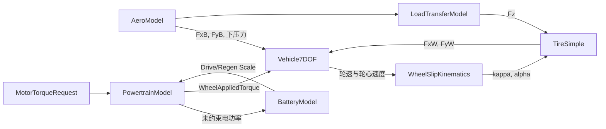

# SlipKinematics–BatteryPowerBaseline 开环 Plant 架构规格

## 1. 信号链



OpenLoopPlantIntegration 集成中，电池缩放只作用于动力系统的“受约束转矩路径”；未约束功率输出不依赖电池缩放。为避免零速时功率比例的代数零解，`VehiclePlant` 在低速且 SOC 高于下限时使用启动比例 1，车速离开启动区后恢复电池比例。该处理不改变 `BatteryModel` 单体的零请求功率比例合同。

## 2. 核心方程

### SlipKinematics 轮胎运动学

```text
Vreg  = sqrt(VxW^2 + Veps^2)
kappa = (Re*omega - VxW) / Vreg
alpha = atan2(VyW, Vreg)
LowSpeedBlend = abs(VxW) / Vreg
```

### SimpleTire 简化轮胎

```text
Fx0 = Ckappa*kappa
Fy0 = -Calpha*alpha + Cgamma*gamma
Flimit = max(mu,0)*max(Fz,0)
scale = min(1, Flimit / sqrt(Fx0^2 + Fy0^2 + Feps^2))
Fx = scale*Fx0
Fy = scale*Fy0
```

### LoadTransfer 准静态轮荷

```text
b = L-a
Ffront = m*g*b/L - m*Ax*h/L + DownforceFront
Frear  = m*g*a/L + m*Ax*h/L + DownforceRear
dFfront = phiF*m*Ay*h/TrackFront
dFrear  = (1-phiF)*m*Ay*h/TrackRear
Fz = [Ffront/2-dFfront/2; Ffront/2+dFfront/2;
      Frear/2-dFrear/2;  Frear/2+dFrear/2]
```

`Ay>0` 为左向加速度，因此右轮载荷增加。输出不静默裁剪，负载荷用于暴露超出模型有效范围；`TireSimple` 在计算摩擦上限时将负轮荷裁为零。

### Aerodynamics 空气动力

```text
Vrel = Vvehicle - Vwind
Vphysical2 = VxRel^2 + VyRel^2
Vreg = sqrt(Vphysical2 + Veps^2)
q = 0.5*rho*Vphysical2
Fx = -q*CdA*VxRel/Vreg
Fy = -q*CdA*VyRel/Vreg
DownforceFront = q*ClAFront
DownforceRear  = q*ClARear
```

### PowertrainLimits 动力系统

电机转速 `omegaMotor=GearRatio*omegaWheel`。请求转矩先经电机转矩限幅和转速边界，再按驱动/再生功率缩放。轮端转矩为电机转矩乘减速比和齿轮效率。电功率采用驱动除以效率、再生乘以效率的符号一致近似。

### BatteryPowerBaseline 电池总功率

```text
Pallowed = clamp(Prequest, -PowerLimitRegen, PowerLimitDrive)
Current = Pallowed/NominalVoltage
SOCDot = -Pallowed/Capacity
```

SOC 达到上下边界时，分别禁止继续放电或继续再生充电。

## 3. 数值与参数

- 所有低速/零功率除法使用显式正则化参数；
- 轮胎和电池限制使用连续分母，硬限制仅用于明确物理边界；
- 参数只从 `VehicleData.sldd` 的 `Vehicle`、`Tire`、`Aero`、`Powertrain`、`Battery` 获取；
- L1 不引入运输延迟、滤波或离散状态，避免在 OpenLoopPlantIntegration 前固化采样时间。
