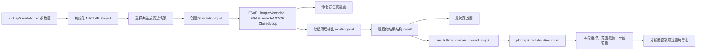

# FSAE 圈速仿真与结果绘图分析脚本规格说明

> 状态：已实施；支持 7DOF/10DOF 选择
> 更新日期：2026-08-05
> 目标环境：MATLAB / Simulink R2026a  
> 适用项目：`FSAE_Simulation.prj`

## 1. 文档目的

本文定义两个 MATLAB 主程序及其辅助函数的需求、接口、目录、结果格式、使用方法和验收标准：

1. 圈速仿真主程序：调用项目现有车辆模型和驾驶员模型，运行可选赛道的时域闭环仿真，并实时显示赛车位置；
2. 绘图分析主程序：读取圈速仿真结果，按用户选择的横轴、纵轴和显示范围绘图。

本文只冻结后续实现方案，不在本阶段修改 Simulink 模型或编写两个主程序。

## 2. 项目现状与实现基础

后续脚本直接复用以下现有资产：

| 类型 | 当前项目资产 | 用途 |
|---|---|---|
| 顶层闭环模型 | `FSAE_TorqueVectoring_ClosedLoop.slx` / `FSAE_Vehicle10DOF_ClosedLoop.slx` / `FSAE_AdaptiveAutocross_7DOF.slx` | 参考速度 7DOF/10DOF 与独立自适应 7DOF 顶层 |
| 车辆模型 | `VehiclePlant.slx` / `VehiclePlant10DOF.slx` | 可选平面轮荷或动态悬架轮荷 Plant |
| 驾驶员模型 | `TorqueVectoringPathTrackingDriver.slx` / `AdaptiveAutocrossDriver.slx` | GGV 参考速度跟踪，或直接使用几何且不读取参考速度 |
| 控制器模型 | `TorqueVectoringVehicleController.slx` | 两类驾驶员共用；TV 由驾驶员配置显式选择 |
| 车辆参数 | `data/VehicleData.sldd` | 车辆、轮胎、动力系统、环境、Bus 和默认值 |
| 仿真输入生成 | `scripts/simulation/createPathTrackingSimulationInput.m` | 创建可重复的 `Simulink.SimulationInput` |
| 结果整理参考 | `scripts/simulation/collectOpenLoopResults.m` | 从 `yout`、`logsout` 读取并规范化信号 |
| 信号合同 | `models/SignalInterfaces.md` | 字段、单位、维度、符号和四轮顺序 |
| 结果字段参考 | `simulation/Result_Signal_Reference.md` | 标准结果容器和绘图分组 |

`FSAE_TorqueVectoring_ClosedLoop.slx` 和 `FSAE_Vehicle10DOF_ClosedLoop.slx` 具有相同的七组顶层输出：

- `VehicleState`
- `PowertrainState`
- `Sensor`
- `TrackReference`
- `ControllerDebug`
- `DriverCommand`
- `ActuatorCommand`

这些输出可直接覆盖位置、速度、加速度、轮荷、轮速、轮胎转角、电机转矩、驾驶员转向请求和控制器状态等主要分析需求。

## 3. 范围和非目标

### 3.1 本次实现范围

- 使用现有时域闭环整车模型和路径跟踪驾驶员模型；
- 支持 `acceleration`、`skidpad`、`autocross`、`endurance` 四种赛道；
- 仿真期间显示赛道、车辆轨迹、当前位置、航向和进度；
- 将规范化结果保存到 `results/`；
- 支持按时间或发车后累计距离绘制任意已记录数值字段；
- 支持横纵轴范围、单位和四轮通道选择；
- 两个主程序及所有新增辅助函数使用中文注释和中文使用说明；
- 缺失信号必须明确报告，不得静默补零。

### 3.2 本次不包含

- 不重新建立车辆模型、驾驶员模型或赛道模型；
- 不把准稳态 `scripts/lap_time/calculateLapTime.m` 作为本次主仿真器；
- 不修改真实车辆参数或把占位参数描述为实测值；
- 不建立 App Designer 图形应用；
- 不承诺实时硬件同步；“实时更新”指仿真运行期间按仿真进度刷新 MATLAB 图窗；
- 不提交大体积仿真结果到 Git。

## 4. 计划目录和文件

项目现有辅助脚本目录名为 `scripts/`，因此本文将用户所述的 `script` 文件夹落实为现有 `scripts/`，不新增重复目录。

```text
simulation/
├── runLapSimulation.m                 # 主程序一：圈速仿真
└── plotLapSimulationResults.m         # 主程序二：结果绘图分析

scripts/
├── simulation/
│   ├── createLapScenario.m            # 统一选择和生成四类赛道
│   ├── createLapSimulationInput.m     # 路由 TorqueVectoring/7DOF 或 Vehicle10DOF/10DOF SimulationInput
│   ├── collectLapSimulationSnapshot.m # 读取终点检查和进度显示所需的最新样本
│   ├── collectLapSimulationResults.m  # 整理七组顶层输出
│   ├── createFinalTrackViewFigure.m   # 创建求解完成后的最终赛道图
│   └── saveLapSimulationResults.m     # 创建运行目录并保存结果
└── reporting/
    ├── loadLapSimulationResult.m      # 加载并校验结果文件
    ├── listLapResultFields.m          # 列出可绘制数值字段
    ├── getLapResultSignal.m           # 按字段路径提取和转换信号
    └── plotLapResultSelection.m       # 按配置绘图和导出

results/
└── time_domain_closed_loop/
    └── <event>/
        └── <yyyyMMdd_HHmmss>_<run_name>/
            ├── lap_simulation_result.mat
            ├── run_config.json
            ├── simulation_summary.json
            └── final_track_view.fig
```

主程序只负责参数选择、流程编排和错误入口；重复逻辑必须放入辅助函数，避免形成超长脚本。

## 5. 总体数据流



## 6. 主程序一：圈速仿真

### 6.1 文件和职责

文件：`simulation/time_domain_closed_loop/simulation/runLapSimulation.m`

职责：

1. 解析项目根目录并初始化 Project；
2. 校验用户参数；
3. 根据赛道名称调用现有场景生成函数；
4. 按 `Vehicle.DynamicsModel` 使用 TorqueVectoring/7DOF 或 Vehicle10DOF/10DOF 成对顶层；
5. 运行闭环仿真、显示命令行进度并捕获异常；
6. 整理、校验和保存结果；
7. 按配置在求解完成后显示最终赛道图；
8. 在命令窗口打印结果目录、赛项时间、圈数、最大加速度和有效性。

### 6.2 参数选择区

主程序开头必须集中提供以下配置，并在每行中文注释中列出可选值和单位：

```matlab
%% 圈速仿真参数选择区

% 赛道名称，可选：
% "acceleration" / "skidpad" / "autocross" / "endurance"
cfg.Track.Name = "autocross";

% 赛道离散采样距离，单位 m
cfg.Track.SampleDistance = 0.5;

% 耐久赛圈数；仅 endurance 使用
cfg.Track.NumberOfLaps = 2;

% 赛道图片路径；空字符串表示优先使用项目已有 CSV
cfg.Track.ImagePath = "";

% 轮胎模型，可选："simple" / "mf62" / "ttc_map"
cfg.Vehicle.TireModel = "mf62";

% 整车动力学，可选："7DOF" / "10DOF"
cfg.Vehicle.DynamicsModel = "7DOF";

% GGV 速度范围由动力系统自动推导；以下配置控制离散、裕度和缓存
cfg.SpeedPlanner.MotorSpeedUtilization = 0.95;
cfg.SpeedPlanner.SpeedStep = 3.0;        % m/s
cfg.SpeedPlanner.ConstraintScale = 0.90;
cfg.SpeedPlanner.LateralPointCount = 9;
cfg.SpeedPlanner.EnvelopePointCount = 32;
cfg.SpeedPlanner.PassCount = 6;
cfg.SpeedPlanner.AllocationMode = "fast";
cfg.SpeedPlanner.UseCache = true;
cfg.SpeedPlanner.ReferenceMaximumSpeed = 22.5;                % m/s
cfg.SpeedPlanner.ReferenceMaximumAcceleration = 6.25;        % m/s^2
cfg.SpeedPlanner.ReferencePlanningDeceleration = 2.50;       % m/s^2
cfg.SpeedPlanner.ReferenceLateralAccelerationLimit = 4.10;   % m/s^2
cfg.SpeedPlanner.ReferenceSpeedSafetyFactor = 1.00;

% NaN 表示使用场景默认停止时间；正数表示覆盖，单位 s
cfg.Simulation.StopTime = NaN;

% 是否在仿真完成后显示最终轨迹图
cfg.Visualization.Enabled = true;

% 结果保存
cfg.Output.RunName = "baseline";
cfg.Output.ResultsRoot = "";             % 空字符串表示 <项目根>/results/time_domain_closed_loop
cfg.Output.SaveRawSimulationOutput = false;
cfg.Output.SaveFinalTrackView = true;
cfg.Output.Overwrite = false;
```

### 6.3 参数字段及可选值

| 字段 | 类型 | 默认值 | 可选值或约束 | 说明 |
|---|---|---:|---|---|
| `Track.Name` | string | `"autocross"` | 四种赛道名称 | 不区分大小写，内部统一转为小写 |
| `Track.SampleDistance` | double | `0.5` | `> 0` m | 影响赛道离散精度 |
| `Track.NumberOfLaps` | double | `2` | 正整数 | 仅耐久赛生效 |
| `Track.ImagePath` | string | `""` | 空或有效文件 | 非默认采样距离时可能需要 |
| `Vehicle.TireModel` | string | `"mf62"` | `mf62/ttc_map` | 时域轮胎与 GGV 使用同一模式 |
| `Vehicle.DynamicsModel` | string | `"7DOF"` | `7DOF/10DOF` | 路由 TorqueVectoring/VehiclePlant 或 Vehicle10DOF/VehiclePlant10DOF |
| `SpeedPlanner.MotorSpeedUtilization` | double | `0.95` | `(0,1]` | 电机机械最高车速利用率 |
| `SpeedPlanner.SpeedStep` | double | `3.0` | `>0` m/s | GGV 速度网格间隔 |
| `SpeedPlanner.ConstraintScale` | double | `0.90` | `(0,1]` | GGV 约束使用比例 |
| `SpeedPlanner.PassCount` | double | `6` | 正整数 | 前向/后向传播次数 |
| `SpeedPlanner.UseCache` | logical | `true` | `true/false` | 复用匹配的 GGV 缓存 |
| `SpeedPlanner.ReferenceMaximumSpeed` | double | `22.5` | `>0` m/s | 参考速度闭环最高车速 |
| `SpeedPlanner.ReferenceMaximumAcceleration` | double | `6.25` | `>0` m/s² | 参考速度闭环规划加速上限 |
| `SpeedPlanner.ReferencePlanningDeceleration` | double | `2.50` | `>0` m/s² | 参考速度闭环规划制动上限 |
| `SpeedPlanner.ReferenceLateralAccelerationLimit` | double | `4.10` | `>0` m/s² | 参考速度闭环横向加速度上限 |
| `SpeedPlanner.ReferenceSpeedSafetyFactor` | double | `1.00` | `(0,1]` | 仅作用于参考速度规划，不继承自适应驾驶员裕度 |
| `Simulation.StopTime` | double | `NaN` | `NaN` 或正数 | `NaN` 使用场景默认值 |
| `Simulation.FinishCheckPeriod` | double | `0.02` | `> 0` s | 按车辆实际位置检查终点并停止求解器 |
| `Visualization.Enabled` | logical | `false` | `true/false` | 求解完成后显示最终轨迹图；关闭后用于批处理 |
| `Output.RunName` | string | `"baseline"` | 非空合法名称 | 保存前移除非法路径字符 |
| `Output.SaveRawSimulationOutput` | logical | `false` | `true/false` | 原始输出体积可能很大 |
| `Output.Overwrite` | logical | `false` | `true/false` | 默认禁止覆盖已有运行 |

### 6.4 四类赛道映射

| `Track.Name` | 现有场景函数 | 当前基础定义 | 圈数规则 |
|---|---|---|---|
| `acceleration` | `createPathTrackingAccelerationScenario` | 75 m 直线加速 | 固定 1 次 |
| `skidpad` | `createPathTrackingSkidpadScenario` | 20 m 入口、右圈两圈、左圈两圈、20 m 出口的完整开放路径 | 固定 1 次完整赛项运行 |
| `autocross` | `createPathTrackingAutocrossScenario` | 复用 FSEC 耐久示意图的 1 km 逆时针仿真代理 | 1 圈 |
| `endurance` | `createPathTrackingEnduranceScenario` | 从 2024 FSEC 手册示意图提取并归一化的 1 km 逆时针单圈 | `Track.NumberOfLaps` |

默认赛道原图为 `scenarios/Endurance/assets/2024_fsec_endurance_track.png`。场景函数按固定 ROI、起点、颜色阈值和平滑距离重建中心线，因此默认和非默认采样距离都不再依赖本机 `autocross_track_map.csv`。自定义 `Track.ImagePath` 仍须指向有效文件。来源和提取假设见 [`data/TrackData/README.md`](../../data/TrackData/README.md)。

Skidpad 几何按 Formula SAE Rules 2026 D.10.1–D.10.2 建模：圆心距
18.25 m、内/外圆直径 15.25/21.25 m、通道宽 3.0 m，行驶顺序为入口、
右圈两圈、左圈两圈、同方向出口。默认入口直道 20 m 来自 2026 FSAE
赛事手册中起跑位置距计时线约 20 m 的场地说明；出口直道采用相同的可配置
场地基线，不把该长度描述为规则强制尺寸。

Skidpad 的重复圆周会在空间中产生相同坐标。为避免路径投影从当前圆周跳到后续
圆周或出口，`createPathTrackingSimulationInput` 按赛道采样距离把局部投影搜索范围限制为
约 10 m；该范围随 `SampleDistance` 换算为采样点数。

仿真通过 `Simulation` 对象按 `FinishCheckPeriod` 推进。完成判定使用车辆
实际 `X/Y` 的局部赛道投影，不直接使用带前视距离的
`TrackReference.PathS`：开放赛道到达路径末端，或沿正方向穿过终点门线且参考路径
已到末端后停止；闭合赛道累计达到目标圈数后停止。正常终点停止写入
`result.Meta.Completed=true` 和 `result.Meta.StoppedAtFinish=true`；若只达到
`StopTime` 而未完成赛项，`Completed=false`。

### 6.5 最终轨迹图

`Visualization.Enabled=true` 时，图窗只在求解和结果整理完成后创建，不在仿真运行中刷新。图中至少包含赛道中心线和边界、速度着色车辆轨迹、起终点、车辆包络越界标记以及结果摘要。坐标轴采用 `axis equal`，不得因纵横比例失真改变赛道形状。批处理时应关闭该选项；图形代码不得放入车辆模型或驾驶员模型内部。

### 6.6 进度和距离定义

为避免“距离”含义不清，结果中同时保存三种量：

| 字段 | 定义 | 用途 |
|---|---|---|
| `Distance` | 根据车辆实际 `X/Y` 累积的发车后行驶距离 | 绘图默认距离横轴 |
| `Track.PathS` | 当前参考点在单圈中心线上的弧长，闭合赛道会回绕 | 单圈位置分析 |
| `Track.EventDistance` | 对 `PathS` 解回绕后的全赛项距离 | 多圈进度和耐久赛绘图 |

实际累计距离按相邻位置点计算：

```text
Distance(1) = 0
Distance(k) = Distance(k-1) + hypot(X(k)-X(k-1), Y(k)-Y(k-1))
```

闭合赛道圈数不得只依赖车辆靠近起点；应结合连续的赛道投影索引、`PathS` 回绕方向和最小前进阈值，避免八字交叉点误计圈。

## 7. 统一结果文件

### 7.1 保存原则

- 默认只保存规范化 `result`，变量名固定为 `result`；
- MAT 文件建议使用 `-v7.3`，以支持长时间耐久赛；
- 原始 `Simulink.SimulationOutput` 只在显式启用时另存；
- 保存目录按赛事和时间戳隔离，默认不覆盖；
- 配置和摘要同时导出为 JSON，便于不启动 Simulink 时检查；
- 原始输出与规范化结果分开，后处理不得改写原始仿真数据。

### 7.2 结果结构

所有时序字段第一维长度必须等于 `numel(result.Time)`。四轮量为 `Nx4`，顺序固定为 `[FL, FR, RL, RR]`。

| 结果组 | 主要字段 | 来源 |
|---|---|---|
| 根字段 | `SchemaVersion`、`Time`、`Distance`、`Meta`、`Config` | 脚本生成 |
| `Track` | `PathS`、`EventDistance`、`LapIndex`、`Progress`、`ReferenceSpeed`、`Curvature`、`LateralError`、`BoundaryViolation`、`VehicleEnvelopeClearance`、`VehicleEnvelopeViolation` | 顶层输出及后处理派生 |
| `Vehicle` | `X`、`Y`、`Psi`、`Ux`、`Uy`、`Speed`、`YawRate`、`RollAngle`、`PitchAngle`、`Ax`、`Ay`、`Az` | `VehicleStateBus` 及派生 |
| `Wheel` | `Speed`、`RPM`、`SteerAngle`、`NormalLoad`、`SlipRatio`、`SlipAngle`、`CamberAngle` | `VehicleStateBus` 及派生 |
| `Tire` | `FxWheel`、`FyWheel`、`MuUtilization` | `VehicleStateBus` |
| `Powertrain` | `MotorTorqueActual`、`MotorSpeed`、`MotorRPM`、`MotorMechanicalPower`、限幅状态 | `PowertrainStateBus` 及派生 |
| `Battery` | `Voltage`、`Current`、`Power`、`SOC` | `PowertrainStateBus` |
| `Driver` | 方向盘/齿条请求、纵向加速度请求、驱动转矩请求、制动压力请求 | `DriverCommandBus` |
| `Actuator` | 齿条请求、四轮电机请求转矩、四轮摩擦制动转矩、四轮再生请求 | `ActuatorCommandBus` |
| `Controller` | 参考横摆角速度、误差、目标力/力矩、TV/TC/再生/能量管理状态 | `ControllerDebugBus` |
| `Sensor` | 位置、车速、加速度、轮速、齿条角、电机测量、电池测量和有效位 | `SensorBus` |
| `Metrics` | 圈时、赛项时间、最大加速度、最大摩擦利用率、能耗、质心越界以及车辆包络最小净空/最大越界/计数/比例 | 后处理派生 |

### 7.3 可用性分级

| 需求信号 | 当前状态 | 处理方式 |
|---|---|---|
| 车辆速度、纵横向加速度 | 可直接记录 | `VehicleStateBus` |
| 四轮法向载荷 | 可直接记录 | `VehicleState.NormalLoad` |
| 四轮轮速、轮胎转角 | 可直接记录 | `WheelSpeed`、`WheelSteerAngle` |
| 四轮电机实际转矩/转速 | 可直接记录 | `PowertrainStateBus` |
| 四轮电机/制动/再生请求转矩 | 可直接记录 | `ActuatorCommandBus` |
| 方向盘请求角 | 可直接记录 | `DriverCommand.SteeringWheelAngleRequest` |
| 转向齿条测量角 | 可直接记录 | `Sensor.SteeringRackAngle` |
| 实际方向盘传感器角 | 当前没有独立字段 | 不得用请求值冒充；需要时扩展 Bus |
| 实际轮端施加转矩 | 顶层 Bus 未独立暴露 | 优先增加内部信号日志；也可保存明确标注的派生估计值 |

任何缺失字段均保持为空并写入 `result.Meta.MissingSignals`，不得用零值伪装为有效结果。

## 8. 主程序二：绘图分析

### 8.1 文件和职责

文件：`simulation/time_domain_closed_loop/plotting/plotLapSimulationResults.m`

职责：

1. 选择具体结果文件，或查找某赛事的最新结果；
2. 校验 `SchemaVersion`、时间向量、字段维度和有限性；
3. 列出当前结果内所有可绘制数值字段；
4. 提取用户选择的横轴和纵轴；
5. 按范围截取数据并进行显示单位转换；
6. 绘制标量或四轮曲线；
7. 可选导出 MATLAB FIG。

### 8.2 参数选择区

```matlab
%% 仿真结果绘图参数选择区

% 结果文件；空字符串表示在指定赛事目录中读取最新结果
plotCfg.Result.File = "";
plotCfg.Result.Track = "autocross";

% 横轴参数，可选字段见本文第 8.3 节
plotCfg.X.Parameter = "Distance";

% 横轴显示范围；[NaN NaN] 表示自动范围
plotCfg.X.Range = [0, 1000];

% 纵轴参数；每个字段默认使用一个子图
plotCfg.Y.Parameters = [
    "Vehicle.Speed"
    "Vehicle.Ax"
    "Vehicle.Ay"
    "Wheel.NormalLoad"
];

% 每行对应一个纵轴字段；[NaN NaN] 表示该字段自动范围
plotCfg.Y.Ranges = [
     0, 30
   -10, 10
   -15, 15
     0, NaN
];

% 四轮通道，可选："FL" / "FR" / "RL" / "RR"
plotCfg.Wheel.Channels = ["FL", "FR", "RL", "RR"];

% 显示单位
plotCfg.Units.Speed = "m/s";       % 可选："m/s" / "km/h"
plotCfg.Units.Angle = "deg";       % 可选："rad" / "deg"
plotCfg.Units.RotationalSpeed = "rpm"; % 可选："rad/s" / "rpm"

% 绘图与导出
plotCfg.Layout = "tabs";           % 可选："tabs" / "overlay"
plotCfg.ShowLegend = true;
plotCfg.ShowGrid = true;
plotCfg.Export.Enabled = false;
plotCfg.Export.Formats = ["fig"];
plotCfg.Export.Directory = "";
```

### 8.3 横轴可选参数

横轴默认只允许标量时序字段：

| 字段 | 单位 | 说明 |
|---|---|---|
| `Time` | s | 仿真时间 |
| `Distance` | m | 发车后车辆实际累计距离 |
| `Track.EventDistance` | m | 解回绕后的赛项中心线距离 |
| `Track.PathS` | m | 单圈中心线弧长 |
| `Track.Progress` | % 或 1 | 全赛项进度 |
| `Vehicle.X` | m | 全局 X 坐标，主要用于 XY 分析 |
| `Vehicle.Y` | m | 全局 Y 坐标，主要用于 XY 分析 |

若横轴不是严格单调，范围筛选按布尔掩码处理，不得使用只适用于单调数据的索引假设。

### 8.4 纵轴主要可选参数

以下字段为首版必须支持的字段；`listLapResultFields` 还应自动列出结果中新增的其他数值字段。

#### 车辆状态

```text
Vehicle.Speed
Vehicle.Ux
Vehicle.Uy
Vehicle.Ax
Vehicle.Ay
Vehicle.Az
Vehicle.YawRate
Vehicle.Psi
Vehicle.RollAngle
Vehicle.PitchAngle
Vehicle.X
Vehicle.Y
```

#### 车轮和轮胎

```text
Wheel.NormalLoad
Wheel.Speed
Wheel.RPM
Wheel.SteerAngle
Wheel.SlipRatio
Wheel.SlipAngle
Wheel.CamberAngle
Tire.FxWheel
Tire.FyWheel
Tire.MuUtilization
```

#### 动力系统和制动

```text
Powertrain.MotorTorqueActual
Powertrain.MotorSpeed
Powertrain.MotorRPM
Powertrain.MotorMechanicalPower
Powertrain.MotorLimitActive
Actuator.MotorTorqueRequest
Actuator.FrictionBrakeTorqueRequest
Actuator.RegenTorqueRequest
Actuator.TotalPowerRequest
Battery.Voltage
Battery.Current
Battery.Power
Battery.SOC
```

#### 驾驶员、转向和控制器

```text
Driver.SteeringWheelAngleRequest
Driver.SteeringRackAngleRequest
Driver.LongitudinalAccelerationRequest
Driver.DriveTorqueRequest
Driver.BrakePressureRequest
Sensor.SteeringRackAngle
Controller.ReferenceYawRate
Controller.YawRateError
Controller.DesiredLongitudinalForce
Controller.DesiredYawMoment
Controller.AllocatedYawMoment
Controller.TVActive
Controller.TCActive
Controller.RegenActive
Controller.EnergyManagementActive
Controller.ControllerSaturated
```

#### 赛道和指标

```text
Track.ReferenceSpeed
Track.Curvature
Track.LateralError
Track.BoundaryViolation
Track.VehicleEnvelopeClearance
Track.VehicleEnvelopeViolation
Track.LapIndex
Track.Progress
```

### 8.5 绘图规则

- 标量字段绘制单条曲线；
- `Nx4` 四轮字段按 `FL/FR/RL/RR` 绘制，颜色固定为蓝/橙/绿/红；
- 每个不同物理单位的字段默认独立子图；
- `overlay` 模式只允许单位相同或用户明确允许双纵轴；
- 范围中的 `NaN` 表示该侧自动缩放；
- `X.Range` 先筛选样本，`Y.Ranges` 再设置坐标轴；
- 角度内部始终保存为 rad，只在显示时转为 deg；
- 速度和转速同样只在显示层转换；
- 标题、坐标轴、图例必须带中文名称和单位；
- 空字段应显示明确警告并跳过，不得生成零曲线；
- 如果所有选定字段均不可用，主程序应报错并打印可用字段列表。

## 9. 中文注释和使用说明要求

两个主程序和所有辅助函数必须满足：

- 文件头中文说明用途、输入、输出、单位和示例；
- 参数选择区逐项列出可选字段或允许范围；
- 关键处理步骤使用中文注释；
- 四轮顺序在相关函数头中重复注明为 `[FL, FR, RL, RR]`；
- 错误信息应说明无效参数名、收到的值和允许值；
- 不使用硬编码绝对项目路径，项目根目录通过当前文件位置或 `currentProject` 获取；
- 路径拼接统一使用 `fullfile`；
- MATLAB 代码保持 R2026a 兼容。

## 10. 预期使用方法

### 10.1 运行圈速仿真

```matlab
projectRoot = "E:\FSAE_model";
openProject(fullfile(projectRoot, "FSAE_Simulation.prj"));
addpath(genpath(projectRoot));
initProject();

% 修改 simulation/time_domain_closed_loop/simulation/runLapSimulation.m 顶部参数区后运行
run(fullfile(projectRoot, "simulation", "time_domain_closed_loop", ...
    "simulation", "runLapSimulation.m"));
```

### 10.2 绘制仿真结果

```matlab
projectRoot = "E:\FSAE_model";

% 修改 simulation/time_domain_closed_loop/plotting/plotLapSimulationResults.m 顶部参数区后运行
run(fullfile(projectRoot, "simulation", "time_domain_closed_loop", ...
    "plotting", "plotLapSimulationResults.m"));
```

绘图脚本不得要求重新运行 Simulink；只要结果 MAT 文件和辅助函数可用，就应能独立完成绘图。

## 11. 异常处理

| 异常 | 要求行为 |
|---|---|
| 项目未初始化 | 自动尝试 `initProject`，失败则给出明确命令 |
| 赛道名称无效 | 报错并列出四个合法值 |
| 非默认 Autocross 采样且图片缺失 | 仿真前报错，不进入 Simulink |
| 仿真出现非有限值 | 保存诊断信息，`Meta.Valid=false` |
| 必需顶层输出缺失 | 结果标记无效并列出缺失字段 |
| 实时图窗更新失败 | 关闭实时更新，仿真继续并给出警告 |
| 用户中止仿真 | 清理回调和图形对象，可选保存部分结果 |
| 保存目录已存在 | 默认创建新 RunID，不静默覆盖 |
| 结果版本不兼容 | 绘图脚本报错并显示期望/实际版本 |
| 用户选中不存在字段 | 打印相近字段和全部可用字段 |
| 范围无数据 | 报错说明当前数据实际范围 |

## 12. 验收计划

| 编号 | 验收内容 | 通过标准 |
|---|---|---|
| T1 | 项目初始化 | 不依赖 Base Workspace 残留变量，可解析数据字典和引用模型 |
| T2 | 四类赛道 | 四个赛道名称均可生成正确场景并启动闭环模型 |
| T3 | 模型复用 | 7DOF/10DOF 分别路由 TorqueVectoring/Vehicle10DOF 顶层，共用驾驶员和控制器，只切换 Plant |
| T4 | 实时显示 | 仿真期间赛道和车辆位置持续更新，最终位置与保存结果一致 |
| T5 | 图窗关闭 | 默认关闭图窗后仿真继续，启用停止选项时可安全中止 |
| T6 | 结果保存 | 每次运行生成唯一目录和 MAT/JSON 文件 |
| T7 | 结果完整性 | 时间严格递增；所有时序字段长度一致；四轮量为 `Nx4` |
| T8 | 缺失信号 | 缺失字段被报告且不补零 |
| T9 | 时间横轴 | 可按选定时间范围正确截取和绘图 |
| T10 | 距离横轴 | 可按 `Distance` 或 `Track.EventDistance` 范围正确绘图 |
| T11 | 四轮曲线 | 可独立选择 FL/FR/RL/RR，顺序和颜色一致 |
| T12 | 单位转换 | m/s↔km/h、rad↔deg、rad/s↔rpm 转换正确 |
| T13 | 用户要求字段 | 速度、纵横向加速度、四轮载荷/转矩/转速、方向盘请求和轮胎转角均可绘制 |
| T14 | 无 Simulink 绘图 | 关闭模型后仍可从 MAT 文件完成分析绘图 |

## 13. 实施顺序

1. 冻结 `result` 结构、字段命名和单位；
2. 实现并验证四类场景统一选择；
3. 实现七组顶层输出收集和结果校验；
4. 实现结果目录、MAT 和 JSON 保存；
5. 用短时间加速场景验证实时更新接口；
6. 实现圈速仿真主程序；
7. 实现字段枚举、提取、单位转换和范围筛选；
8. 实现绘图主程序；
9. 对四类赛道和代表性字段执行验收测试；
10. 补充 README 入口和变更记录。

开始编码前，应先确认本文中的结果字段合同；实现过程中如需修改现有 Bus，必须单独进行影响分析。

## 14. 已知限制和待确认项

1. 当前车辆、气动和部分动力系统参数仍包含占位值，结果不能直接解释为实车性能；
2. 目标胎 43075 的纵向/联合滑移数据仍使用代理来源；
3. Endurance 当前复用 1 km Autocross 路线，圈数为用户参数，不代表官方赛制圈数；
4. Autocross 赛道宽度仍是临时 3 m 基线；
5. 默认赛道图片当前不存在，非默认采样距离必须提供图片；
6. 当前模型提供方向盘请求角而非独立的实际方向盘传感器角；
7. 实际轮端施加转矩尚未在顶层 Bus 中独立暴露；

## 15. API 验证记录

已由项目现有代码确认的接口：

- `openProject`、`currentProject`、`Simulink.fileGenControl`：见 `scripts/initialization/initProject.m`；
- `Simulink.SimulationInput`、`setVariable`、`setModelParameter`：见 `scripts/simulation/createPathTrackingSimulationInput.m`；
- `Simulink.SimulationOutput`、`yout`、`logsout`、`Simulink.SimulationData.Dataset`：见 `scripts/simulation/collectOpenLoopResults.m`；
- 场景生成函数及参数签名：见 `scenarios/Acceleration`、`Skidpad`、`Autocross`、`Endurance`；
- 顶层七组输出已通过模型读取确认。

尚需在实现前验证：

- R2026a 中最适合当前模型的异步仿真控制接口；
- 仿真运行期间读取最新 `VehicleState` 数据的接口和更新频率；
- 仿真中止、图窗关闭和异常路径下的清理行为。

## 附录 A：相关文档

- [项目 README](../../README.md)
- [系统架构](../../models/Architecture.md)
- [信号接口合同](../../models/SignalInterfaces.md)
- [ResultVisualization 结果信号参考](../Result_Signal_Reference.md)
- [阶段验证历史](../../tests/Verification_History.md)
- [整车仿真开发蓝图](../../ROADMAP.md)
